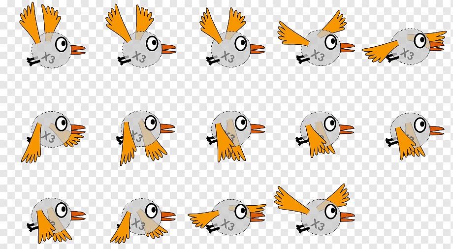

# Texture Atlas Generator in ActionScript3
A powerful and flexible API to generate texture atlases



A texture atlas (also called a spritesheet or an image sprite in 2d game development) is an image containing multiple smaller images, usually packed together to reduce overall dimensions. An atlas can consist of uniformly-sized images or images of varying dimensions. A sub-image is drawn using custom texture coordinates to pick it out of the atlas. This API provides the corresponding functionalities in easy to use, yet powerful and flexible methods. The API is dependent upon [Rectangle Bin Pack](https://github.com/EhsanMarufi/Rectangle-Bin-Pack-AS3) (just another nibblesSoft package).

You may even use the API dynamically:
```as3
package {
  import nibblesSoft.atlasGenerator.AtlasGenerator;
  import nibblesSoft.atlasGenerator.AtlasGeneratorEvent;
  import nibblesSoft.atlasGenerator.AtlasItem;
  
  import com.adobe.images.PNGEncoder;
  
  import flash.filesystem.File;
  import flash.filesystem.FileMode;
  import flash.filesystem.FileStream;
  import flash.utils.ByteArray;
  
  public class DynamicAtlasGenerator
  {
     public function DynamicAtlasGenerator() {}
     
     public static function provideTextures(stage:Stage):void
     {
        var dynamicAtlas:AtlasGenerator = new AtlasGenerator(
           n * x, n * x,
           [movieClip1, movieClip2, movieClip3], // Your animations or graphic assets
           StageQuality.BEST,
           scaleFactor,
           true, // scaleFilters
           4,    // subTexturesGap
           false // debugging
         );
         
        dynamicAtlas.addEventListener(Event.COMPLETE, onCompleteGeneratingDynamicAtalses);
        dynamicAtlas.addEventListener(AtlasGenerator.PROGRESS, onProgressGeneratingDynamicAtlases);
        dynamicAtlas.beginBatchDraw(stage);
     }
     
     private static function onCompleteGeneratingDynamicAtalses(e:AtlasGeneratorEvent):void
     {
        trace("Dynamic Atlas Generator is Done :)");
        var atlas:AtlasGenerator = e.atlasGeneratorObj;
        
        var totalAtlasesCount:uint = atlas.spriteSheets.length;
        trace("Total count of TextureAtlases generated: " + totalAtlasesCount);
        
        // save to files
        saveAtlasObjects(atlas, "\\relative\\path\\to\\save\\");
     }
     
     private static function saveAtlasObjects(atlas:AtlasGenerator, desktopDirectoryName:String):void
     {
        var totalAtlasesCount:uint = atlas.spriteSheets.length;
        var byteArray:ByteArray;
        var fs:FileStream = new FileStream();
        var destDirectoryPath:String = File.desktopDirectory.nativePath + desktopDirectoryName;
        
        for (var i:uint = 0; i < totalAtlasesCount; ++i)
        {
           byteArray = PNGEncoder.encode(atlas.spriteSheets[i]);
           var pngFile:File = new File(destDirectoryPath + "spritesheet-" + i + ".png");
           fs.open(pngFile, FileMode.WRITE);
           fs.writeBytes(byteArray);
           fs.close();
           
           var xmlFile:File = new File(destDirectoryPath + "xml-" + i + ".xml");
           fs.open(xmlFile, FileMode.WRITE);
           fs.writeUTFBytes(atlas.XMLs[i]);
           fs.close();
        }
     }
  }
}
```

All the code is released to Public Domain. Patches and comments are welcome.
It makes me happy to hear if someone finds the algorithms and the implementations useful.

Ehsan Marufi<br />
<sup>December 2017</sup>